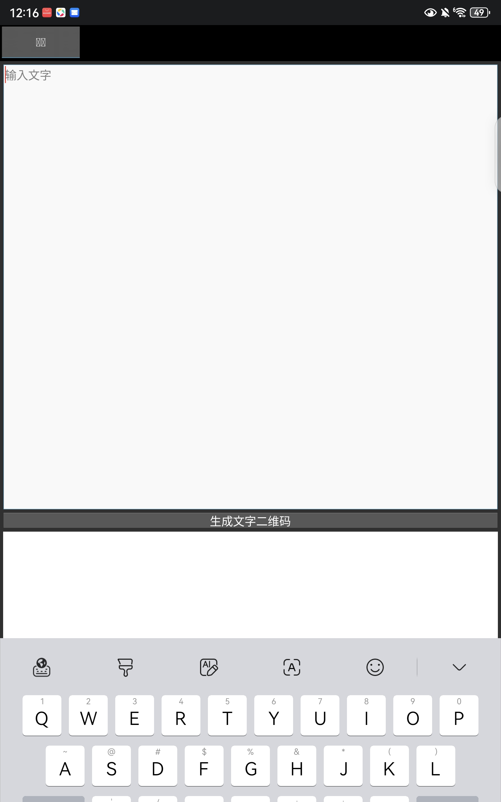
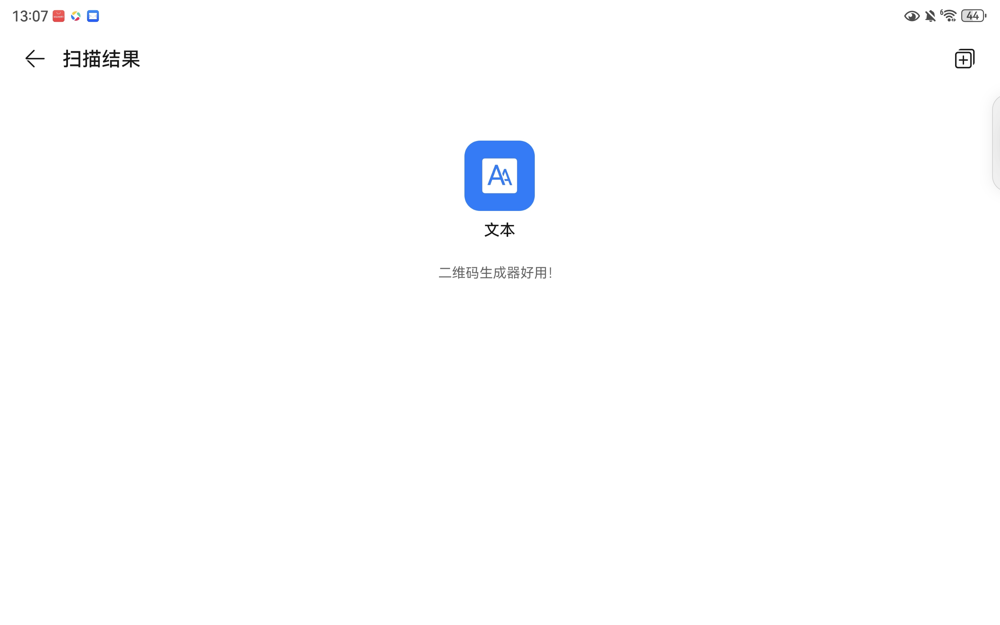
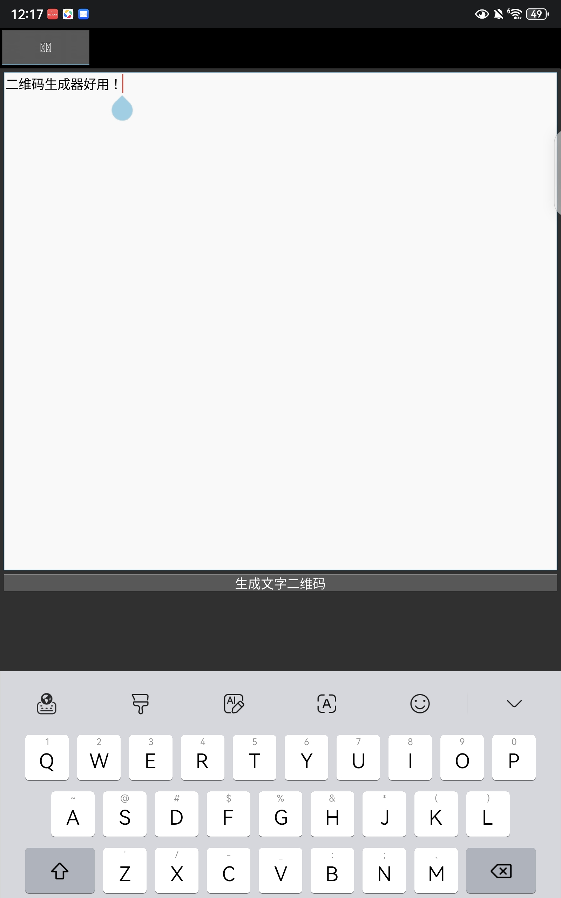
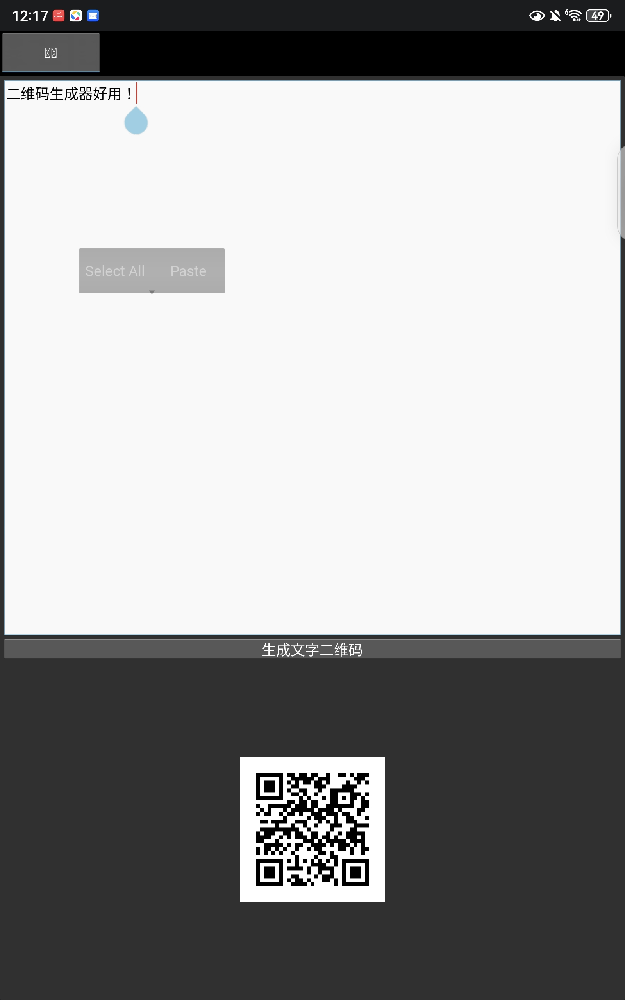

<h2 style="color:#2E8B57">QR Code Generator</h2>

# QR-Code-Generator

一个轻量级文字二维码生成器，基于 Python + Kivy 开发，支持 Android 与桌面平台。

只需输入文字，一键生成二维码，扫码即可读取内容。

---

## 商店下载

---

## 📸 主界面

## 📱 操作流程

| 扫描结果 | 输入文字 | 成品 |
|----------|------------|----------|
|  |  |  |

---

## ✨ 功能特点

- ✅ 输入任意文字（支持中文），即时生成二维码
- ✅ 极简操作，无广告，纯本地生成，不联网
- ✅ 自动适配 Android 系统字体，中文显示清晰
- ✅ 生成的二维码可截图保存或分享

---

## 📦 获取应用

### 直接下载 APK（Android 推荐）

前往本仓库的 [Releases](https://github.com/dwkw98/QR-Code-Generator/releases) 页面，下载最新版本的 APK 安装包，在手机上安装即可使用。
（如果有电脑端的用户，请克隆项目，具体步骤请搜教程）

[project](https://github.com/dwkw98/QR-Code-Generator)
---
